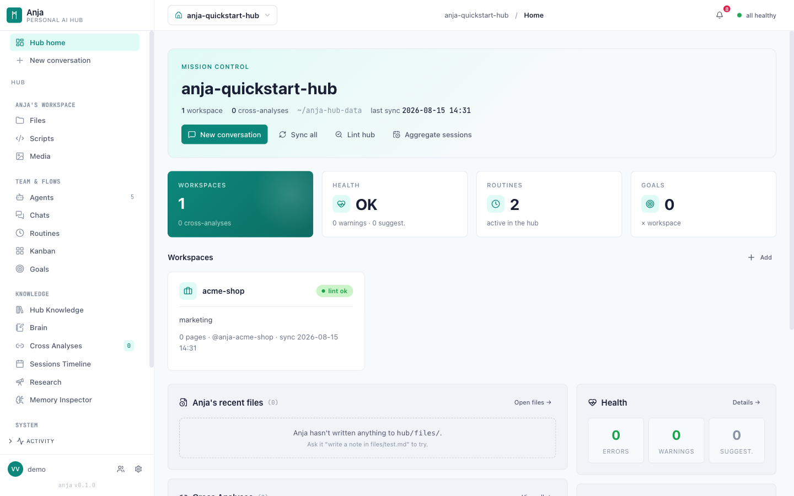
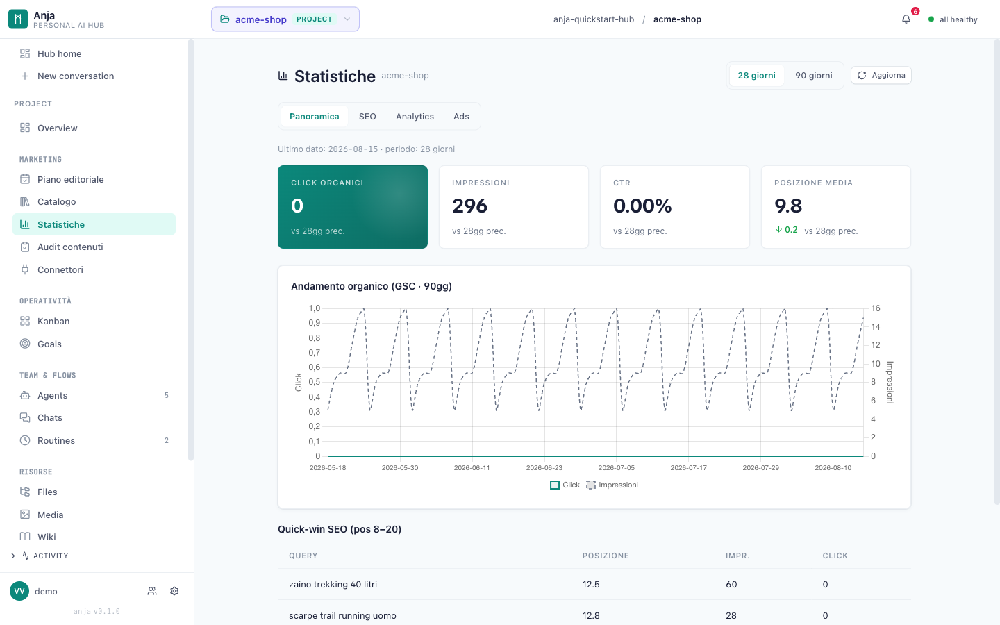
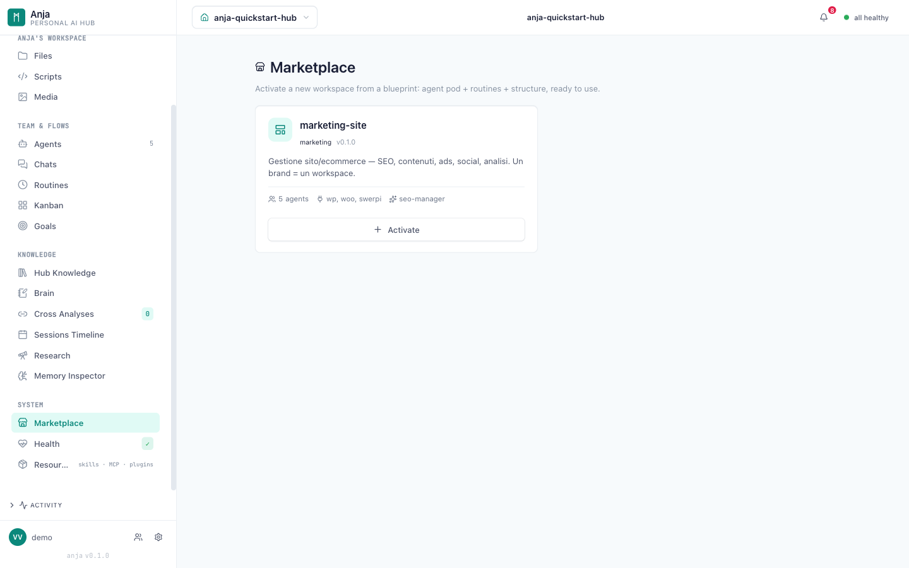

# Anja Hub ᛗ

**Your personal AI hub — self-hosted.** One place where AI agents with
persistent memory manage your projects, brands, and automations: a Mission
Control web app, a Telegram bot, a cron-like routines daemon, multi-workspace
isolation, and multi-LLM support — built on the
[Claude Agent SDK](https://docs.claude.com/en/api/agent-sdk/overview) and the
[Model Context Protocol](https://modelcontextprotocol.io).

> ⚠️ Status: **beta (v0.9)**. Battle-tested daily on real workloads by its
> author, but the public API and setup flow are still stabilizing. The web UI
> is English; agent prompts are currently Italian-first (agents reply in your
> configured language) — i18n contributions welcome.



## What it does

- **Mission Control** — web app with multi-pane chat (Claude subscription via
  SDK, OpenAI, Gemini, xAI, OpenRouter…), workspace switcher, memory
  inspector, media gallery, statistics dashboards, kanban, goals.
- **Workspaces from blueprints** — one command scaffolds a complete vertical
  workspace: a pod of specialized agents, routines, connector schema, and
  editorial templates. Ships with a `marketing-site` starter blueprint
  (SEO + content + social + ads for a brand site or e-commerce). Private
  blueprints can be dropped in `<hub>/blueprints/` — no fork needed.
- **Agents with real memory** — structured wiki per project/workspace,
  identity files, session journals, semantic search (via the
  [anjadev](https://github.com/vincent-vigorito/anjadev) MIT plugin).
- **Telegram bot** — full agent sessions from your phone: steering, permission
  control (inline ✅/🚫 buttons, `/mode`), multi-thread conversations, voice
  replies, image/video generation delivered as photos in chat. Link a chat
  from the UI with a one-time code (Settings → Integrations → Telegram).
- **Routines daemon** — cron-like YAML routines with action handlers (email,
  Slack, Google Chat, wiki, file, webhook).
- **Marketing integrations** — Google Search Console, GA4, Google Ads
  (native API: campaigns, keywords, search terms), Merchant Center, Meta
  (Facebook/Instagram) insights and ads, WordPress content + **WooCommerce
  orders** (real sales: revenue, AOV, new customers, cash ROAS) — collected
  into per-workspace SQLite metrics with dashboards and audit scoring.
- **Media generation** — image/video generation via CLI on Gemini, OpenAI,
  xAI, OpenRouter (Seedream/Seedance/Veo), with a unified model catalog.
- **Research** — web search skills (DuckDuckGo free, Google grounding via
  Gemini) and Gemini Deep Research integration (cited reports, async).
- **Multi-user (Concierge mode)** — optional login with owner/admin/member
  roles and per-workspace membership. Single-user "Personal" mode is the
  zero-friction default.
- **Governance** — cost tracking, decision trail, self-health monitoring,
  encrypted secrets vault, backup/restore with memory time-machine.

## Screenshots

| Workspace statistics (demo data) | Blueprint marketplace |
|---|---|
|  |  |

## Requirements

- Python **3.12+**
- [Claude Code](https://claude.com/claude-code) CLI installed on the host
  (the Claude provider uses your subscription — no API key needed; you can
  sign in from Settings → Providers, no shell needed)
- macOS or Linux

## Quickstart

```bash
git clone https://github.com/vincent-vigorito/anja-hub.git
cd anja-hub
python3.12 -m venv .venv && source .venv/bin/activate
pip install -r anja-hub/webapp/requirements.txt

# 1. create your hub (data directory, separate from the code)
python3 anja-hub/scripts/init_hub.py --target ~/anja-hub-data

# 2. start Mission Control
python3 anja-hub/webapp/server.py --hub ~/anja-hub-data --port 8765
```

Open http://127.0.0.1:8765 — the onboarding flow takes it from there.

API keys for optional providers (OpenAI, Gemini, xAI…) are configured from
the UI (Settings → Integrations) and stored in an encrypted vault inside your
hub directory. See `.secrets.env.example` in your hub for the env-file
alternative.

## Google connectors (Search Console, GA4, Merchant Center, Ads)

Anja calls the Google REST APIs directly with **your own OAuth client** — no
third-party service in between, and no shared credentials shipped with the
code (each installation brings its own client, as with any self-hosted app).
One-time setup:

1. In [Google Cloud Console](https://console.cloud.google.com/) create a
   project, enable the APIs you need (*Search Console API*, *Google Analytics
   Data API*, *Merchant API*, *Google Ads API*), and create an **OAuth client
   ID** of type *Web application* with redirect URI
   `http://<your-hub-host>:8765/api/google/oauth/callback`
   (`http://127.0.0.1:8765/...` for a local hub).
2. Download the client JSON and **upload it from the app**: **Settings →
   Integrations → Google OAuth client** (the card shows the exact redirect
   URI to paste in Cloud Console and a step-by-step guide). One client per
   installation, shared by all workspaces.
3. In each workspace: **Connectors → Connect Google** → consent → pick your
   Search Console site / GA4 property / Merchant account from the dropdowns.
   Tokens refresh automatically. No shell access to the server needed at any
   point.

**WooCommerce** needs nothing extra: the WordPress Application Password you
already set in the workspace connectors also reads `wc/v3` orders (the WP
user needs shop permissions). Set the workspace backend to `woo` and the
Sales tab lights up on the next statistics refresh.

**Google Ads** has two modes:
- *Default*: spend, clicks and revenue per campaign are read from **GA4**
  (`advertiserAdCost`), which needs nothing beyond the GA4 link — but it is
  an estimate.
- *Native Google Ads API*: set a **developer token** in Settings →
  Integrations → Google Ads API (from Google Ads → Tools → API Center; needs
  *basic access* to read real accounts) plus the customer ID in the
  workspace connectors. You get native metrics (impressions, CTR, CPC,
  conversions, keyword and search-term reports) via the `ads_report` agent
  tool and the statistics collector. Read-only for now.

## Architecture

```
anja-hub/               # plugin + Mission Control webapp
├── webapp/             # FastAPI server + UI (vanilla JS + Alpine)
├── scripts/            # MCP servers (marketing, images, hub API…) + init
├── blueprints/         # workspace blueprints (starter: marketing-site)
├── skills/             # agent skills (research, media, hub-admin…)
└── templates/          # hub/agent/user skeletons
anja-routines/          # cron-like daemon + action handlers
```

- **Code vs data**: the repo is the platform; your hub lives in a separate
  directory (created by `init_hub.py`) containing config, workspaces, wiki,
  vault, and media. Updates are `git pull` + restart — your data is never
  touched.
- **MCP-first**: external capabilities are MCP servers, scoped per turn by a
  keyword router to keep token usage low. Hub self-management uses a thin
  REST interface instead.
- **Multi-harness**: agent memory (wiki/identity/skills) also works from
  Codex, OpenCode, and Grok Build via the
  [anjadev](https://github.com/vincent-vigorito/anjadev) plugin.

## Security

Hardened for self-hosting: CSRF protection, SSRF guard with IP pinning,
path-traversal defenses, authorization gates on all mutating endpoints,
fail-closed auth middleware in multi-user mode, rate-limited login, CSP
headers, and an encrypted (Fernet) secrets vault. A 25-check security gate
suite runs in `anja-hub/tests/test_security_gates.py`. See
[SECURITY.md](SECURITY.md) for reporting vulnerabilities.

## Contributing

See [CONTRIBUTING.md](CONTRIBUTING.md). All contributions require a DCO
sign-off (`git commit -s`).

## License

Code: [MIT](LICENSE) © Vincent Vigorito.
The Anja name and the Mannaz logo ᛗ are trademarks — see
[TRADEMARK.md](TRADEMARK.md).
